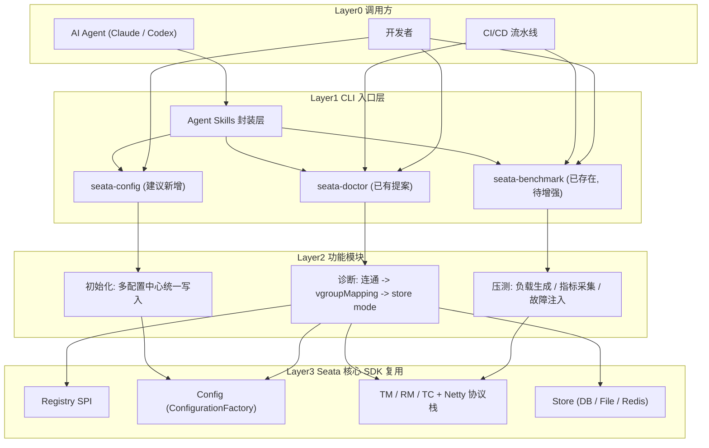
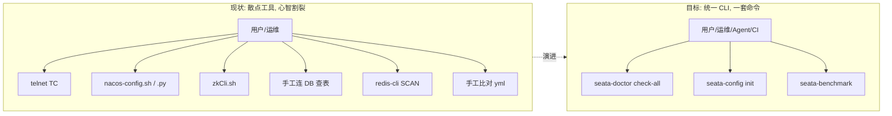
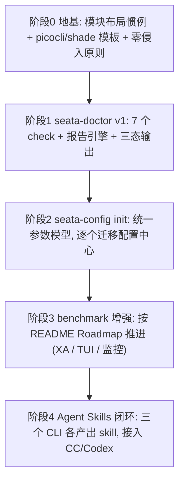
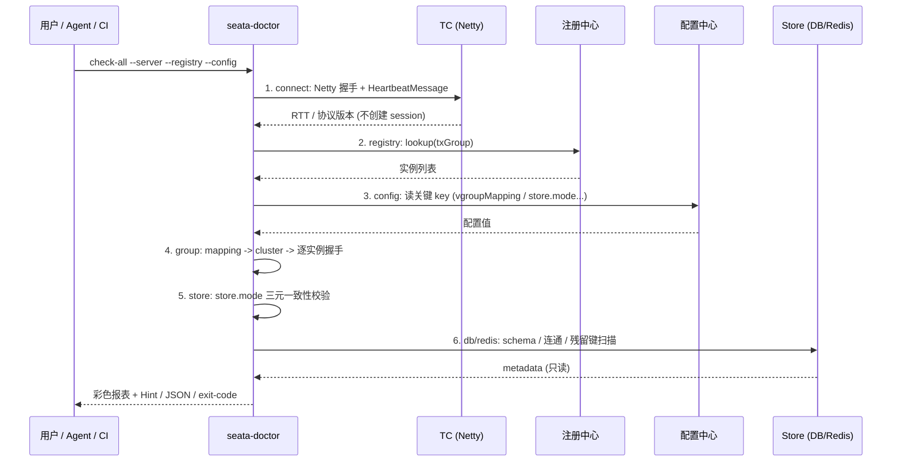

# Seata CLI 工具集与 Agent Skills 愿景

> 一份面向团队 / 社区的分享文档。背景源自社区讨论 [Provide and continue to improve the relevant CLI and skills for Seata (#8073)](https://github.com/apache/incubator-seata/discussions/8073)。

---

## 1. 一句话概述

> 把 Seata 散落在各处的"运维 / 诊断 / 压测 / 初始化"能力，统一收敛成一套**跨平台的 Java 命令行工具（CLI）**，并为它们配上 **AI Agent 可直接调用的 skills**——让**开发者、AI Agent（Claude / Codex）、CI/CD 流水线**用同一套命令完成从"装环境"到"排故障"再到"压性能"的全流程闭环。

核心思路只有一句话：**所有 CLI 都不重新实现连接逻辑，而是复用 Seata 自己的核心 SDK**（注册中心 SPI、配置中心 SPI、TM/RM/TC 协议栈、Store 层）。工具是 SDK 的"只读消费者"，因此天然与 Seata 版本同步演进、零侵入、可信。

### 全景架构




四层含义：

- **Layer 0 调用方**：开发者、AI Agent、CI/CD 三类入口被一视同仁地当作"命令行调用"。
- **Layer 1 CLI 入口层**：青色=已存在的 `seata-benchmark`；新增 `seata-doctor` / `seata-config`；以及面向 Agent 的 skills 封装层。
- **Layer 2 功能模块**：每个 CLI 细分为单一职责的子模块。注意 `seata-doctor` 的三个检查维度（连通性 -> vgroupMapping -> store mode）是**递进**的，诊断顺序也遵循这一递进。
- **Layer 3 核心 SDK**：Registry、Config、TM/RM/TC、Store 在所有 CLI 之间共享同一套实现，避免重复造连接逻辑——这是整个提案最大的工程优势。

---

## 2. 我们要做什么（What）

分三条工作线 + 一条贯穿线：

- **增强 `seata-benchmark`（已存在）**
当前已有 [test-suite/seata-benchmark-cli](test-suite/seata-benchmark-cli/README.md)，支持 AT / TCC / SAGA / SAGA_ANNOTATION 四种事务模式、空跑/真实双模式、TPS 控制、故障注入、CSV 导出等。按其 README 的 Roadmap 继续打磨：v1.1（P99.9、真实 TCC try/confirm/cancel、XA 模式），v2.0（实时 TUI、监控集成 global_table/branch_table、分布式压测协调）。
- **新增 `seata-doctor`（已有 openspec 提案）**
面向"启动前 / 故障第一现场"的客户端自助诊断 CLI。覆盖 6 类高频故障：TC 网络可达、注册中心可读、配置中心可读、事务分组 `service.vgroupMapping.<group>` 映射存在、`store.mode` 三元一致（`store.mode` / `store.lock.mode` / `store.session.mode`）、DB / Redis schema 正确。详见 [openspec/changes/add-seata-doctor-cli/proposal.md](openspec/changes/add-seata-doctor-cli/proposal.md)。典型用法：

```bash
seata-doctor check-all --server 127.0.0.1:8091 --registry nacos --config file
seata-doctor explain group my_tx_group   # 一站式: mapping -> cluster -> 实例列表 -> 实测 Netty 握手
```

- **新增 `seata-config`（建议）**
把 [script/config-center/](script/config-center/README.md) 下分散的 **14 个**针对 nacos / zk / apollo / consul / etcd3 的 shell 与 python 脚本，统一成**一个跨平台 Java CLI**。这一块价值最大：更好的跨平台兼容（Windows + Linux 一致）、复用 Seata 自身的配置模型。典型用法：

```bash
seata-config init --type nacos --server-addr 127.0.0.1:8848 --namespace seata
```

- **贯穿线：Agent Skills 封装层**
为上述每个 CLI 提供 Claude / Codex 可读的 skill 描述（命令语义、参数、典型场景）。让不熟悉 Seata 的人也能用自然语言驱动 Agent 直接执行命令，形成"提问 -> 诊断 -> 修复 -> 验证"的完整开发闭环。

---

## 3. 为什么要这么做（Why）

### 3.1 现状痛点

**排障要在 5~6 个工具之间反复跳跃。** Seata 客户端"启动失败"和"事务卡住"两类故障，99% 的根因落在前述 6 个环节，但当前定位它们要串起：`telnet TC`、`nacos-config.sh`、`zkCli.sh`、业务侧 `application.yml` 比对、手工连 DB 看 `lock_table`、`redis-cli SCAN SEATA_`*。新人启动失败时拿到的报错往往是 `no available service "default"` 或 `can not get cluster name`，**根因不可见**。

**配置初始化脚本碎片化。** `script/config-center/` 下现存 14 个文件，按"配置中心 × 交互/非交互 × shell/python"维度分裂（如 `nacos-config.sh` / `nacos-config-interactive.sh` / `nacos-config.py` / `nacos-config-interactive.py`），Windows 与 Linux 行为不一致，且无法复用 Seata 自己的配置模型。




### 3.2 行业趋势

当前趋势是 **CLI 优先、弱化 MCP**：CLI 跨平台、可脚本化、易被 Agent 直接调用，形成完全闭环的开发流程。最典型的两个例子：

- **GitHub CLI（`gh`）**：把原本散落在 Web 控制台的操作（PR、Issue、Actions、Release、`gh api`）统一成一套命令，既能被人手敲，也能被 Agent / CI 直接编排——`gh pr create`、`gh run watch` 已经是大量自动化流水线和 AI Agent 的标准入口。
- **飞书 CLI（**`lark` **/ Lark OpenAPI CLI）**：把企业内的消息、文档、审批、画板等能力收敛成命令行，让"在终端 / 脚本 / 机器人里一行命令触达飞书"成为常态，同样是"人 + Agent + 自动化"共用一套入口的范式。

它们共同印证了一个方向：**好用的能力最终都会沉淀成 CLI，再被 Agent 当作工具调用**。Seata 目前恰好缺这样一套统一入口。


目前我个人都是选择尽量使用cli，以上两个cli都是我日常用的很多的且十分推荐的两个cli！

友商内部其实已经全面cli化了，基础设施都是配套cli，实现端到端闭环(TRD、开发、测试、部署等热点场景)


### 3.3 最大的工程优势：共享同一套核心 SDK

三条工作线复用 Seata 仓库里已经存在的全部"原料"：

- `discovery/seata-discovery-`*：9 套注册中心 SPI（`RegistryService.lookup`）
- `config/seata-config-*`：6 套配置中心 SPI（`Configuration.getString`）
- `core/`：完整的 Netty + 协议栈（`HeartbeatMessage`、`RpcClientBootstrap`）
- `test-suite/seata-benchmark-cli`：已经把 picocli + Maven shade + Seata SDK 接线打通的 CLI 模板

这意味着新工具**不写一行重复的 RPC / discovery / config 实现**，连接逻辑与 Seata 主版本同生命周期演进。

---

## 4. 如何做（How，逐步深入）

整体按"先打地基，再由易到难逐层落地"的路线推进：




- **阶段 0 — 地基**
确立模块布局惯例：新工具放在 `test-suite/seata-*`，与 `test-suite/seata-benchmark-cli` 形成同级镜像，共享 picocli + maven-shade 模板。确立**零侵入原则**：只读消费 `core` / `discovery` / `config` 的 SPI，不修改 `core` / `server` / `rm-*` / `tm` 任何运行时代码。
- **阶段 1 — `seata-doctor` v1**
落地已有 openspec 提案：7 个 check（connect / registry / config / group / store / db / redis）+ 报告引擎（`Severity` / `CheckResult` / `ReportPrinter` / `HintLibrary`）+ 人读 / JSON / exit-code 三态输出。任务分解见 [tasks.md](openspec/changes/add-seata-doctor-cli/tasks.md)，契约见 [spec.md](openspec/changes/add-seata-doctor-cli/specs/seata-doctor-cli/spec.md)。
- **阶段 2 — `seata-config init`**
抽象统一参数模型，逐个迁移配置中心：nacos -> zk -> apollo -> consul -> etcd3，每一步都与旧脚本（[script/config-center/](script/config-center/README.md)）的行为对齐，确保平滑替换。
- **阶段 3 — benchmark 增强**
按 [test-suite/seata-benchmark-cli/README.md](test-suite/seata-benchmark-cli/README.md) 的 Roadmap 推进。
- **阶段 4 — Agent Skills 闭环**
为三个 CLI 各产出 skill，接入 Claude Code / Codex，形成"人 / Agent / CI 三入口"的闭环。

### 4.1 关键设计原则

以下原则均沿用 `seata-doctor` 的 [design.md](openspec/changes/add-seata-doctor-cli/design.md) 决策：

- **零侵入**：工具只作为现有模块的只读消费者，不改动任何运行时代码。
- **严格只读**：v1 任何操作都不会改变被检测系统的状态（例如 `--scan-orphans` 仅 `SCAN MATCH` 列出可疑残留键，**不发 `DEL`**），删除动作仍保留在运维手里。
- **单 fat jar + profile 裁剪**：默认 fat jar < 30MB，只打最普遍的 `file + nacos + zk` 注册/配置中心 + MySQL 探测；其他通过 `-Pwith-etcd3` / `-Pwith-oracle` / `-Pwith-all` 等 profile 选择性引入，避免单 jar 膨胀。
- **三态输出**：人读（彩色对齐表 + `Hint:` 行）、机器读（`--json`）、CI 读（`--exit-code`，`0=clean / 1=warn / 2=error`，参考 shellcheck / pylint 语义）。
- **JDK 8 floor + CI 矩阵兼容**：与 `build/pom.xml` 的 `source/target = 1.8` 一致，并在 JDK 8/17/21/25 矩阵下编译通过，遵守 spotless / pmd / license 三道质量门。

### 4.2 代表性示例：`seata-doctor check-all` 的递进式诊断

诊断顺序本身就是"逐步深入"的最佳示例——从最底层的网络连通，逐层向上到事务分组、存储模式、后端 schema：




---

## 5. 预期收益（Benefits）

- **新用户**：首次接 Seata 时，一行 `seata-doctor check-all` 即可拿到带 `Hint:` 的 actionable 报告，把根因从"不可见"变成"一眼可见 + 给出修复锚点"。
- **运维**：线上事务卡住时，5 秒一键体检快速排除环境问题再深入业务逻辑；`seata-config init` 提供跨平台一致的配置初始化，告别 Windows/Linux 脚本分裂。
- **CI/CD**：`--exit-code` 可直接接入 K8s readiness probe 与部署后 smoke test；benchmark 可做容量回归。
- **AI Agent**：skills 让不熟悉 Seata 的人用自然语言驱动 Agent 完成"诊断 -> 修复 -> 验证"闭环。
- **社区**：统一的工具心智 + 降低上手门槛，让更多人能用 Agent 学习并操作 Seata；所有工具与主版本同步演进，长期维护成本可控。

---

## 6. 风险与边界

**风险（及缓解）：**

- Seata 主版本升级协议（RPC magic / 序列化器）后，工具需同步发版——通过绑定父 `<revision>`、CI 在协议变更 PR 中一并编译工具来及时发现。
- nacos / zk 等 native client 连接重试耗时会让工具看起来"卡住"——每个 check 默认 `--timeout 10s`，超时归 FAIL 并持续打印进度行。
- v1 严格只读、不自动修复——这是刻意的信任契约取舍：宁可让用户手动执行删除/建表，也绝不让工具误改被检测系统。

**明确的非目标：**

- 不取代 `console`（事务列表 / 详情 / 回滚等 web 运维操作）。
- 不取代 `seata-benchmark` 的压测定位。
- v1 不做自动修复（不自动 `DEL` Redis 残留锁、不自动 `CREATE TABLE undo_log`）。

---

## 7. 附录

### 7.1 关键命令速查

```bash
# 诊断
seata-doctor check-all --server 127.0.0.1:8091 --registry nacos --config file
seata-doctor check connect  --server 127.0.0.1:8091
seata-doctor explain group  my_tx_group

# 配置初始化
seata-config init --type nacos --server-addr 127.0.0.1:8848 --namespace seata

# 压测
java -jar seata-benchmark-cli.jar --server 127.0.0.1:8091 --mode AT --tps 100 --duration 60
```

### 7.2 相关链接

- 社区讨论：[Provide and continue to improve the relevant CLI and skills for Seata (#8073)](https://github.com/apache/incubator-seata/discussions/8073)
- `seata-doctor` 提案：[proposal.md](openspec/changes/add-seata-doctor-cli/proposal.md) / [design.md](openspec/changes/add-seata-doctor-cli/design.md) / [tasks.md](openspec/changes/add-seata-doctor-cli/tasks.md) / [spec.md](openspec/changes/add-seata-doctor-cli/specs/seata-doctor-cli/spec.md)
- 现有压测工具：[test-suite/seata-benchmark-cli/README.md](test-suite/seata-benchmark-cli/README.md)
- 现有配置初始化脚本：[script/config-center/README.md](script/config-center/README.md)

